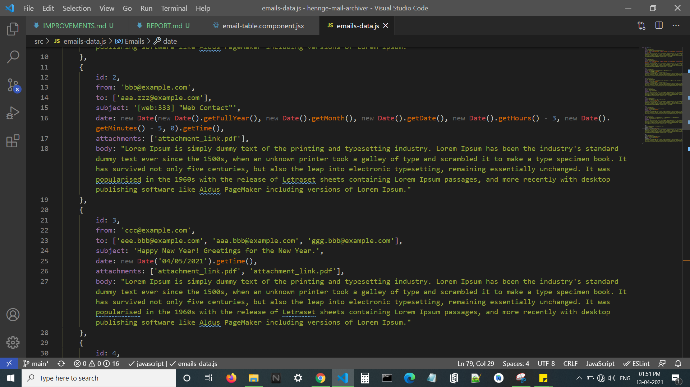
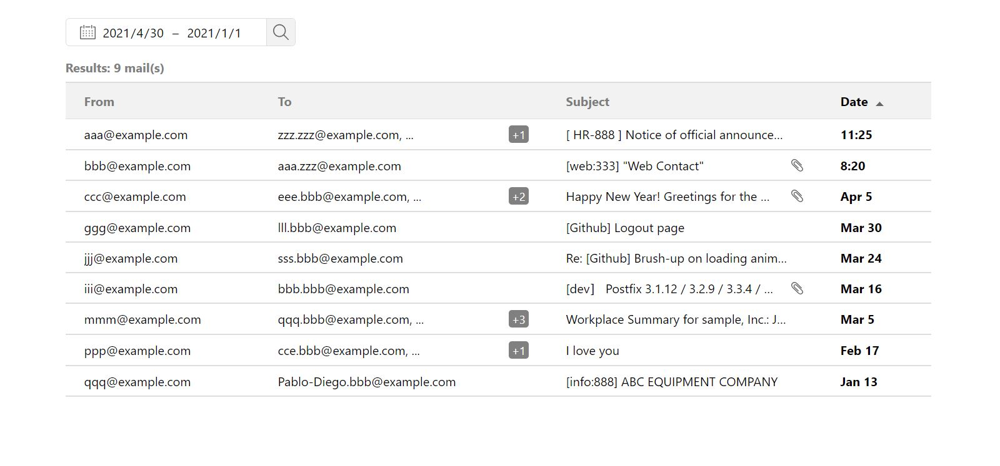
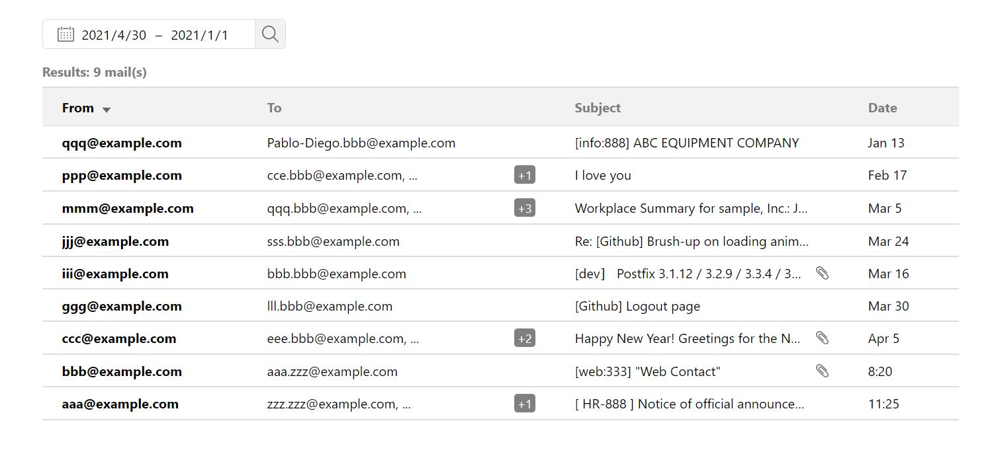
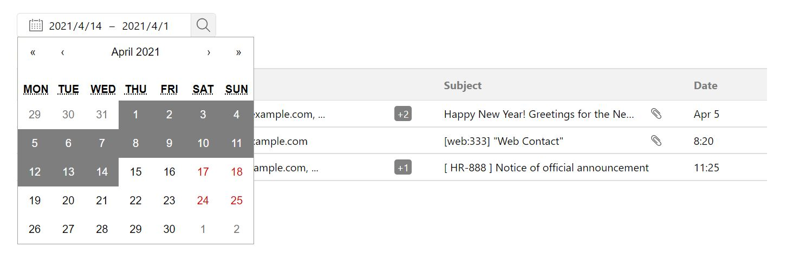
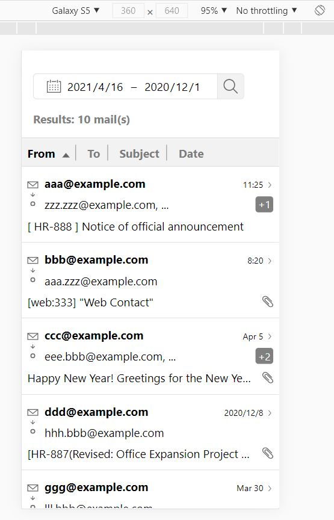
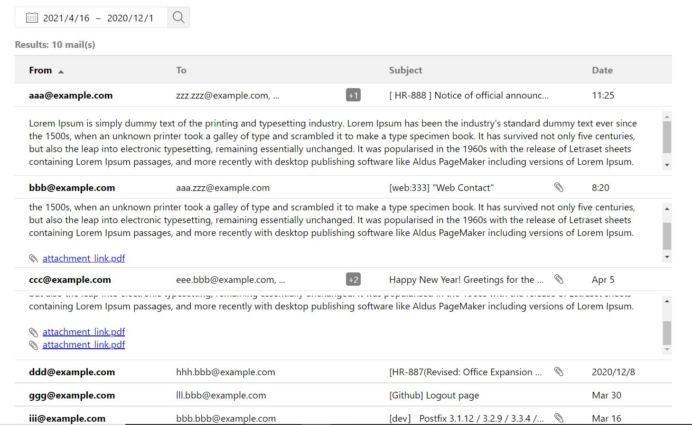
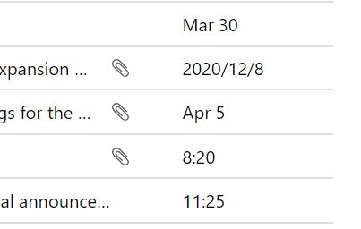

Made this project as part of assignment step of an interview. Sharing the report and my thought process below -

# **REPORT**

- I started by analyzing the given mockup and mission requirement.

- I was thinking about building the project in either **Angular** or **ReactJs**. I checked **HENNGE's** [tech stack](http://stackshare.io/hennge) and found that React is being used in their stack. So I decided to use React as well.

- For styling, **SCSS** is being used. Added `node-sass` package to React so that it can preprocess SCSS.

- For the email table I had option of using `Material Table` which comes inbuilt with all the sorting and other useful table features. But I decided to build the table and sorting by myself as it would be good learning experience for me. Also it is easier to customize as per required UI when using your own implementation.

---

- **Date Picker:** For Date range picker, I went with [wojtekmaj/react-daterange-picker](https://github.com/wojtekmaj/react-daterange-picker). It was very simple and provided simple API. Also, it was very easy to modify its UI with minimum efforts.

---

- **Mock Data:** Created mock emails list object. I have added dynamic dates for 2 emails so that they emulate today's time. I have also added dates for previous month and previous year to cover all cases shown in mockup.

---

- **Email table:** It is built using simple Html `<table></table>` element with custom sorting functionality.

---

- **Sorting:** For sorting functionality I have made use of `React Hooks` such as `useState` and `useMemo`. Sorting arrow dynamically changes orientation based on ascending or descending order of sorting. Column `font-weight` changes to `bold` for sorted column.

---

- **Filter:** Emails are filtered based on the date range selected by user. By default the date is set to today's date. Filtered email list passed to email table component as `props`. 

---

- **Responsive:** For making the UI responsive for mobile screens I have used media queries targeting max width of `480px`. I have converted `table` html elements into `flex` structure in order to achieve the UI for mobile.

---
- **Email Body:** Email body can be viewed by clicking on any of table row. It will expand right below so that it can be inspected. Multiple email rows can be expanded at once.

---
**Dates:** If email date is today's date then it's is shown as time when the email was received. If it's not today's date then its is shown as `MMM d` format. If the email is from previous year then its shown in `yyyy/mm/d` format.

